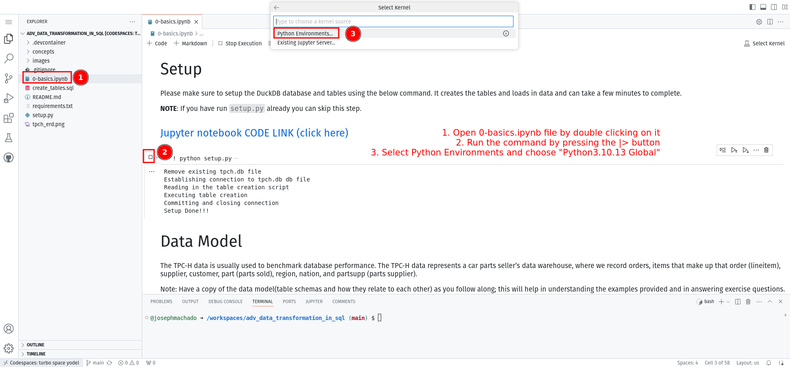

# Pre-requisities for Hands-on Data Engineering Workshop

## Prerequisites

1. Sign up for a Github account.

## Setup

You have two options to run the exercises in this repo

### Option 1: Github codespaces (Recommended)

Steps:

1. Create [Github codespaces with this link](https://github.com/codespaces/new?skip_quickstart=true&machine=basicLinux32gb&repo=871360230&ref=main&geo=UsEast).
2. Wait for Github to install the [requirements.txt](./requirements.txt). This step can take about 5 minutes.
        
3. Now open [python-basics](./python/basics.ipynb) and [sql-basics](./sql/basics.ipynb) as shown below.
        
4. Complete both the notebooks.

### Option 2: Run locally

Steps:

1. Clone this repo, cd into the cloned repo
2. Start a virtual env and install requirements.
4. Start Jupyter lab and run the `ipynb` notebooks.
5. Now open [python-basics](./python/basics.ipynb) and [sql-basics](./sql/basics.ipynb).
5. Complete both the notebooks.

```bash
git clone https://github.com/josephmachado/de-workshop-prereq.git
cd de-worshop-prereq
python -m venv ./de-env # create a virtual env
source de-env/bin/activate # use virtual environment
pip install -r requirements.txt
jupyter lab
# Ctrl + c to quit
deactivate # to exit the virtual environment
```


